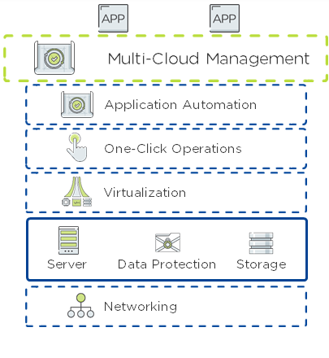

# Platform Specific Architecture for Nutanix

Description

<!-- TOC -->

- [Platform Specific Architecture for Nutanix](#platform-specific-architecture-for-nutanix)
  - [Nutanix: Overall Architecture](#nutanix-overall-architecture)
  - [Nutanix: HCI Architecture](#nutanix-hci-architecture)
  - [Nutanix: Supported Platforms](#nutanix-supported-platforms)
    - [Nutanix: Storage Configurations](#nutanix-storage-configurations)
  - [Nutanix: Virtual Hostname/IP](#nutanix-virtual-hostnameip)
  - [Nutanix: High Availability](#nutanix-high-availability)
  - [Nutanix: Disaster Recovery](#nutanix-disaster-recovery)
  - [Nutanix: Data Tiering Options](#nutanix-data-tiering-options)

<!-- /TOC -->

## Nutanix: Overall Architecture

Nutanix delivers a web-scale, hyperconverged infrastructure solution purpose-built for virtualization and both containerized and private cloud environments. This solution brings the scale, resilience, and economic benefits of web-scale architecture to the enterprise through the Nutanix enterprise cloud platform, which combines the core HCI product families—Nutanix AOS and Nutanix Prism management—along with other software products that automate, secure, and back up cost-optimized infrastructure.

Available attributes of the Nutanix enterprise cloud OS stack include:

- Optimized for storage and compute resources.
- Machine learning to plan for and adapt to changing conditions automatically.
- Intrinsic security features and functions for data protection and cyberthreat defense.
- Self-healing to tolerate and adjust to component failures.
- API-based automation and rich analytics.
- Simplified one-click upgrades and software life cycle management.
- Native file services for user and application data.
- Native disaster recovery solutions.
- Powerful and feature-rich virtualization.
- Flexible virtual networking for visualization, automation, and security.
- Cloud automation and life cycle management.

Nutanix provides services and can be broken down into three main components: an HCI-based distributed storage fabric, management and operational intelligence from Prism, and AHV virtualization. Nutanix Prism furnishes one-click infrastructure management for virtual environments running on AOS. AOS is hypervisor agnostic, supporting two third-party hypervisors—VMware ESXi and Microsoft Hyper-V—in addition to the native Nutanix hypervisor, AHV.

## Nutanix: HCI Architecture
Nutanix does not rely on traditional SAN or network-attached storage (NAS) or expensive storage network interconnects. It combines highly dense storage and server compute (CPU and RAM) into a single platform building block. Each building block delivers a unified, scale-out, shared-nothing architecture with no single points of failure.

The Nutanix solution requires no SAN constructs, such as LUNs, RAID groups, or expensive storage switches. All storage management is VM-centric, and I/O is optimized at the VM virtual disk level. The software solution runs on nodes from a variety of manufacturers that are either entirely solid-state storage with NVMe for optimal performance or all-SSD storage that provides a combination of performance and additional capacity. The storage fabric automatically tiers data across the cluster to different classes of storage devices using intelligent data placement algorithms. For best performance, algorithms make sure the most frequently used data is available in memory or in flash on the node local to the VM.

You can find the Nutanix best practice guides for SAP HANA on AHV, SAP HANA on vSphere, and SAP HANA with Nutanix on HPE on the Nutanix Partner portal under the "Solutions Documentation" area in the "Documentation" section: https://portal.nutanix.com/page/documents/solutions/list
  - SAP HANA on AHV - https://portal.nutanix.com/page/documents/solutions/details?targetId=BP-2097-SAP-HANA-on-AHV:BP-2097-SAP-HANA-on-AHV
  - SAP HANA on vSphere - https://portal.nutanix.com/page/documents/solutions/details?targetId=BP-2110-SAP-HANA-on-vSphere:BP-2110-SAP-HANA-on-vSphere
  - SAP HANA with Nutanix on HPE - https://portal.nutanix.com/page/documents/solutions/details?targetId=BP-2098-SAP-HANA-with-Nutanix-on-HPE:BP-2098-SAP-HANA-with-Nutanix-on-HPE

## Nutanix: Supported Platforms

You can find all supported hardware platforms to run the Nutanix enterprise cloud OS stack via the SAP HANA hardware directory, under the "Certified HCI SOlutions" section: https://www.sap.com/dmc/exp/2014-09-02-hana-hardware/enEN/#/solutions?filters=v:deCertified;hci;v:174

### Nutanix: Storage Configurations

- Storage for Nutanix

## Nutanix: Virtual Hostname/IP

Link to generic content: [Module: Virtual Hostname/IP](../generic_architecture/module_virtual_hostname.md#module-virtual-hostnameip)

- how to implement virtual IP - maybe additional network interface?
- reference to Instance Move and how to execute Nutanix specific steps (move network interface?)

## Nutanix: High Availability

Link to generic content: [Module: High Availability](../generic_architecture/module_high_availability.md#module-high-availability)

- link to list of Availability Zones in Nutanix
- comment that it is important to measure AZ latency via niping (I will add this as new section in general part)
- fencing mechanism (options, recommendation)
- how to implement cluster IP ?
  - provide some details
- links to Nutanix/SUSE/RHEL documentation
- how to modify cluster to have active/active
- how to modify cluster to have tenant specific cluster IPs
- anything else?

## Nutanix: Disaster Recovery

Link to generic content: [Module: Disaster Recovery](../generic_architecture/module_disaster_recovery.md#module-disaster-recovery)

- anything to consider? bandwidth?

## Nutanix: Data Tiering Options

Link to generic content: [Module: Data Tiering Options](../generic_architecture/module_data_tiering.md#module-data-tiering-options)

- what is supported what is not (matrix)
- links to Nutanix documentation
- modified pictures of storage setup (if required)